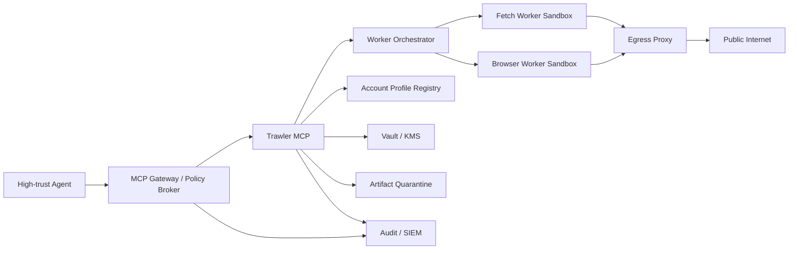
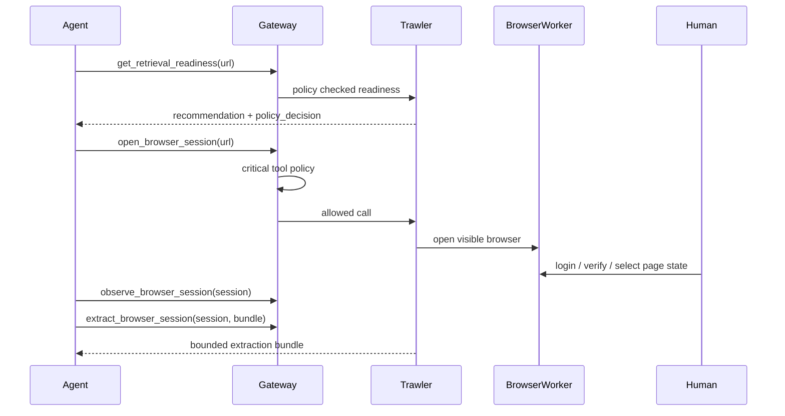

# Trawler MCP 高安全部署架构

整理时间：2026-07-07

Trawler 的定位是“AI 用的真实浏览器内容获取层”。这意味着它天然需要访问外网、启动浏览器、读取页面、保存调试证据和账号态。对于安全要求很高的 Agent 系统，Trawler 不应该和核心 Agent 放在同一个信任边界里。

推荐架构是：



## 信任分区

| 分区 | 放什么 | 原则 |
|---|---|---|
| 高信任区 | Agent、业务数据、任务决策 | 不直接访问外网，不直接运行浏览器 |
| 策略区 | MCP Gateway、Policy Broker、审计 | 统一授权、域名策略、工具风险等级、人工确认 |
| Trawler 控制区 | MCP 工具层、任务编排、账号画像、站点画像 | 不执行任意网页代码，只调度受控 worker |
| Worker 区 | HTTP 抓取、浏览器、解析器 | 可丢弃、可限权、可重建 |
| 出站区 | Egress Proxy、DNS/redirect/IP 记录 | 所有外网流量统一出口，网络层兜底 SSRF |
| 隔离存储区 | Artifact、截图、HTML、console、request log | 不可信内容隔离，默认只给 summary |
| 密钥区 | vault key、代理凭据、第三方 API key | 外部 KMS/Vault，租约、轮换、吊销 |

## 已落到代码的 P0 基线

### 1. Policy Broker

模块：[trawler/policy.py](../trawler/policy.py)

它集中判断：

- 工具风险等级：low / medium / high / critical
- 目标域名 allow / deny
- live browser 是否启用
- CDP 是否启用
- crawl_site 是否启用
- artifact body 是否允许读取
- crawl 最大页数硬限制
- 是否需要人工确认

相关环境变量：

```bash
TRAWLER_POLICY_MODE=permissive
TRAWLER_ALLOWED_DOMAINS=
TRAWLER_BLOCKED_DOMAINS=
TRAWLER_ENABLE_LIVE_BROWSER=1
TRAWLER_ENABLE_CDP=1
TRAWLER_ENABLE_CRAWL_SITE=1
TRAWLER_EXPOSE_ARTIFACT_BODIES=0
```

`permissive` 用于本地开发，保留兼容行为；`strict` 用于生产/高安全环境，未知工具和缺少目标域名的风险调用会被拒绝。

### 2. MCP 工具入口拦截

高风险入口已经接入策略：

- `retrieve_page`
- `crawl_url`
- `crawl_site`
- `crawl_site_indexed`
- `open_browser_session`
- `connect_browser_session`
- `run_browser_actions`
- `observe_browser_session`
- `extract_browser_session`
- `get_raw`
- `get_artifact`
- `get_artifact_screenshot`
- `cleanup_artifacts`

被拒绝时返回标准错误：

```json
{
  "errorType": "permission-denied",
  "policy_decision": {
    "allowed": false,
    "tool": "open_browser_session",
    "risk": "critical",
    "reasons": ["live_browser_disabled"]
  }
}
```

### 3. Retrieval Readiness 里带策略判断

`get_retrieval_readiness` 现在会返回 `policy_decision`。AI 在正式调用前可以同时看到：

- 站点画像
- 账号画像
- vault 状态
- 推荐工具
- 当前策略是否允许

### 4. Observe 页面观察

新增工具：

```text
observe_browser_session(session_id, selector="body", max_elements=80)
```

它只观察，不执行动作，返回：

- 可操作元素
- 稳定 CSS selector
- role / name / text
- 元素位置 rect
- action hints
- accessibility snapshot

它不会返回输入框当前 value，避免把密码、验证码、token 带进 MCP 响应。

## 推荐生产流程

### 单页授权浏览器获取



### 高安全异步获取

更高安全级别下，Agent 不直接等浏览器结果，而是：

1. Agent 提交 retrieval job。
2. Gateway 记录 actor、tenant、domain、tool、policy version。
3. Worker 在 sandbox 里执行。
4. Artifact 进入 quarantine。
5. Trawler 返回 sanitized result。
6. 需要 HTML/body/screenshot 时再走二次批准。

## 仍建议部署层继续做的能力

### Egress Proxy

代码里的 SSRF 是应用层保护；生产还应该在网络层兜底：

- Worker 只能访问 egress proxy。
- Proxy 拒绝 localhost、内网、metadata IP、异常端口。
- Proxy 记录 DNS、resolved IP、redirect 链。
- 浏览器子请求也必须经过同一个出口。

参考：[OWASP SSRF Prevention Cheat Sheet](https://cheatsheetseries.owasp.org/cheatsheets/Server_Side_Request_Forgery_Prevention_Cheat_Sheet.html)

### Worker Sandbox

建议分级：

1. rootless container
2. readonly rootfs
3. drop capabilities
4. seccomp / AppArmor
5. gVisor / Kata / Firecracker for browser workers

浏览器 worker 应该是一次性或短租约资源，结束后清理 profile/tmp。

### Artifact Quarantine

建议后续给 artifact 增加状态机：

```text
quarantined -> scanned -> redacted -> approved -> expired
```

默认只允许 `get_artifact_summary`，`page.html` 这类 body 读取必须显式打开 `TRAWLER_EXPOSE_ARTIFACT_BODIES=1` 或由 Gateway 批准。

### Vault Provider

当前 Account Profile Registry 只保存元数据，账号态由 `account_vault` 加密。生产建议把以下 secret 迁到外部 Vault/KMS：

- `TRAWLER_VAULT_KEY`
- 代理凭据
- 第三方 reader/API key
- CapSolver key

Trawler 只拿短租约，不持久保存明文 secret。

## 安全审计清单

- 工具调用记录：actor、tool、domain、policy decision、risk、approval。
- 网络记录：resolved IP、redirect chain、proxy、blocked reason。
- 浏览器动作记录：action type、index、status，不记录 typed text。
- Artifact 记录：artifact_id、reason、files、size、body exposure。
- Job 记录：owner/context、TTL、page budget、cancel 权限。
- 账号记录：account_id、status、last_verified_at、expires_at，不记录密码。

## 结论

Trawler 可以继续作为 MCP 存在，但它在高安全 Agent 系统里应该是“受控外网能力”，不应该和 Agent 同一信任边界。当前代码已经具备统一策略层、可观察浏览器、账号画像、站点画像、SSRF、artifact body gate 等基础。下一步真正生产化时，重点是 Gateway、sandbox、egress proxy、Vault 和 artifact quarantine。
